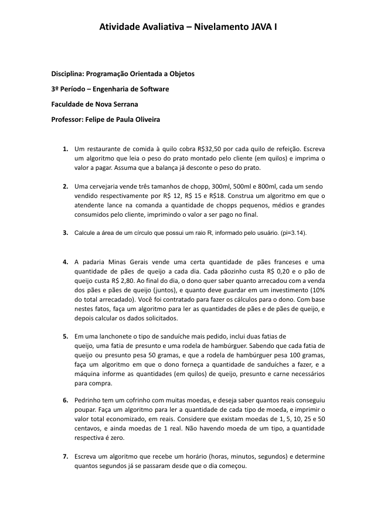
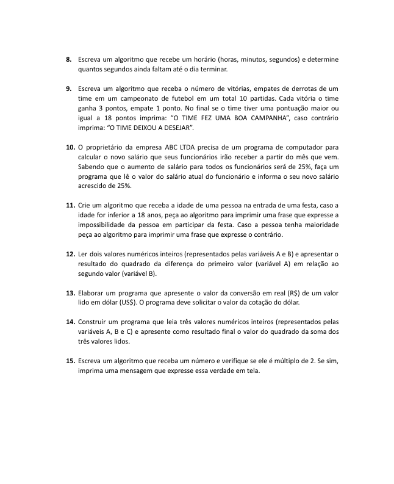

# Introdução ao Java ☕

Exercícios iniciais em Java abordando lógica de programação, estruturas básicas e fundamentos utilizados na disciplina de Programação Orientada a Objetos, desenvolvidos durante o **3º período do curso de Engenharia de Software na Faculdade de Nova Serrana (FANS)**.

---

## Atividades Propostas

### Parte 1

### Parte 2

---

## Objetivo

Praticar a construção de algoritmos,fundamentais para o desenvolvimento de sistemas em Java.

---

##  Tecnologias Utilizadas

- Java
- Lógica de programação

---

##  Autor
**Matheus Pereira**   
- Estudante de Engenharia de Software Faculdade de Nova Serrana  
- Apaixonado por desenvolvimento desktop em Python  
- GitHub: https://github.com/MatheusPereiira

---
